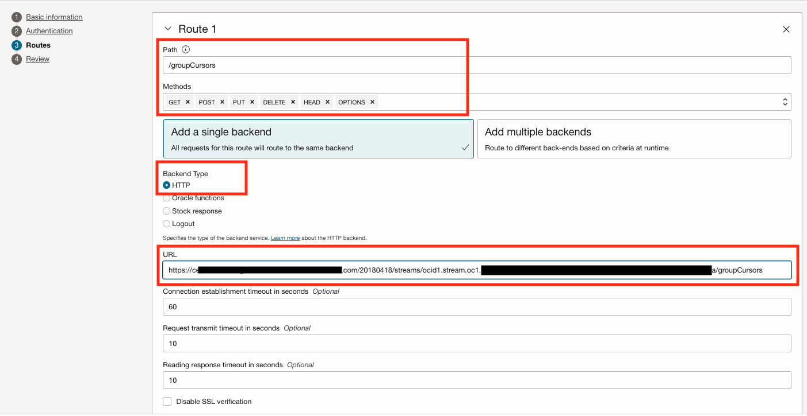

# Consuming OCI Streaming topic behind an API Gateway using OCI REST API


## Introduction

The Oracle Cloud Infrastructure Streaming service provides a fully managed, scalable, and durable solution for ingesting and consuming high-volume data streams in real-time. Use Streaming for any use case in which data is produced and processed continually and sequentially in a publish-subscribe messaging model.

### Objective  

This tutorial demonstrates how to consume OCI Streaming topic using API Gateway REST API calls.

### Prerequisites

* Provide the following:  
   - Oracle account with proper access permissions
   - A compartment to create your resources
   - Local OCI-CLI setup, if you need help, check the [Installing the CLI tutorial](https://docs.oracle.com/en-us/iaas/Content/API/SDKDocs/cliinstall.htm)
   - VCN with two subnets (Private & Public), check the [Creating Network tutorial](https://docs.oracle.com/en-us/iaas/Content/GSG/Tasks/creatingnetwork.htm)
   - OCI Streaming topic [Creating OCI Stream tutorial](https://docs.oracle.com/en-us/iaas/Content/Streaming/Tasks/creatingstreamsandstreampools_create-stream.htm)
   - Local Python version 3 installed for testing


## Task 1: Get details from your OCI Streaming

   1. Go to your stream and grab the OCID, click on **Analytics & AI** under **Messaging**, click on **Streaming** and select your stream.

      Take note of the **OCID** and **Message Endpoint**, you're going to need it for your API Gateway:  

      

## Task 2: Create a public API Gateway  

To create a new API Gateway, click on **Developer Services**, under **API Management**, click on **Gateways** and then **Create Gateway**

   

## Task 3: Create a deployment for your API Gateway

Select your recent created API Gateway, then click on **Deployments** then **Create Deployment** 

Now, create your prefix by replacing **<your_ocid_for_stream>** with your stream OCID bellow, fill the name as **publicTopic**.  


  ```
   /20180418/streams/<your_ocid_for_stream>
  ```

     
   
   Click **Next**  

     

   Click **Next**  

Creating **Route 1** for **groupCursors**:  
Create the URL using the **endpoint** and **stream OCID** you've gathered on **task 2** of this tutorial and build your URL:

   ``` 
    <streaming_endpoint>/20180418/streams/<stream_ocid>/groupCursors
   ```

>**Note**: To consume the stream, the OCI REST API for Streaming uses two endpoints **groupCursors** and **messages**, you need to create those two routes:  
Now fill down the needed information such as **Path**, **Methods**, **Backend type** as bellow:  

     

Click on button **+Another route** and add **Route 2** for **messages**:  
Using the same URL but with the different endpoint at the end as **/messages**  

     


Go to your publicTopic and take note of the API Gateway **endpoint**:  
   
     


## Task 4: Produce some random messages on your streaming to be consumed on the next step. 

Go to your Streaming page, and click on **Produce Test Message**:  

  
  
  

## Task 5: Consuming OCI Streaming via REST API bethind the API Gateway  

   1. Download the sample python consume code [consume_rest_api_oci_lab.py](./files/consume_rest_api_oci_lab.py)

   2. Change the values for your **API Gateway** endpoint and **stream OCID** as indicated with the values you gathered earlier on this tutorial:   

      

   3. Run your python code to verify it's working:  
     
   ```
   python3 consume_rest_api_oci_lab.py
   ```

      


## Related Links

- [OCI CLI Install and Setup](https://docs.oracle.com/en-us/iaas/Content/API/SDKDocs/cliinstall.htm)

- [Creating Virtual Cloud Network (VCN)](https://docs.oracle.com/en-us/iaas/Content/GSG/Tasks/creatingnetwork.htm)

- [Creating OCI Streaming](https://docs.oracle.com/en-us/iaas/Content/Streaming/Tasks/creatingstreamsandstreampools_create-stream.htm)

## Acknowledgments

* **Author** - Joao Tarla (Oracle LAD A-Team Solution Engineer)  
